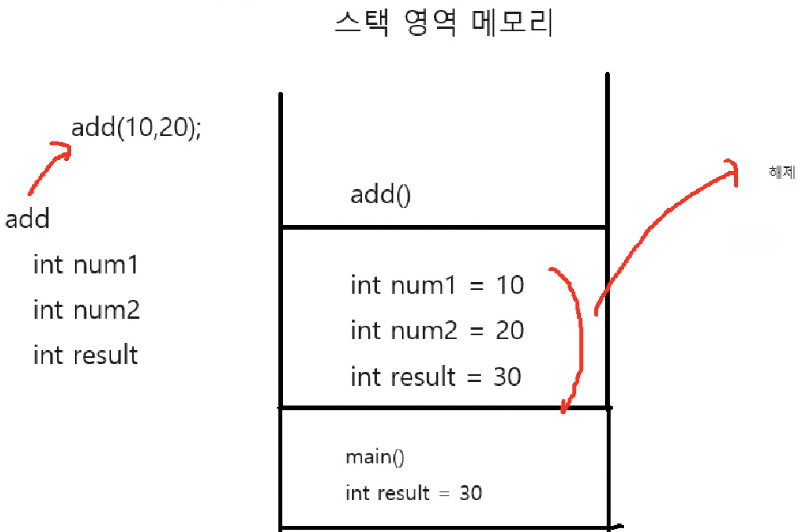
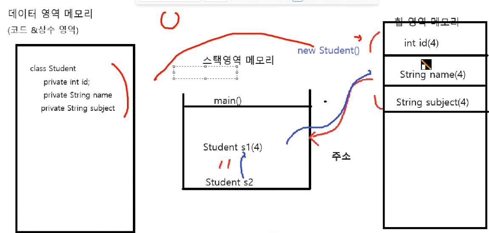

## 1. 롬복라이브러리를 설치하고 적용해보자
___
```
  <dependency>
    <groupId>org.projectlombok</groupId>
    <artifactId>lombok</artifactId>
    <version>1.18.30</version>
    <scope>provided</scope>
  </dependency>
```
 - `pom.xml`파일의 `dependencies`에 롬복을 추가한다.
- `setting` 메뉴의 `Editor` -> `General` -> `Auto Import`

<br>
<br>

## 2. 롬복 라이브러리의 애너테이션(📂ex01)
___

#### 💾 Book 클래스와 BookMain 클래스<br>
 
 - `@Data` : `@Getter` +  `@Setter` + `@ToString` + `@EqualsAndHashCode`
 - 생성자 오버로딩 :
   - @NoArgsConstructor(access = AccessLevel.PRIVATE) : 기본 생성자 / 접근제어자 설정(디폴트는 public)
   - @RequiredArgsConstructor : final 필드에 자동 부여
   - @AllArgsConstructor : 모든 필드에 자동 부여
 - `@NonNull` : not null
 - `@With` : setter의 불변 클래스

<br>

- https://velog.io/@dani0817/JAVA-Lombok-%EB%9D%BC%EC%9D%B4%EB%B8%8C%EB%9F%AC%EB%A6%AC

<br>
<br>

## 3. 클래스와 인스턴스 객체의 개념(📂ex02)
___
#### 💾 Student 클래스와 StudentMain 클래스<br>
 - 클래스 : 설계도
 - 객체 : 설계도를 통해 만들어진 실체
 - 인스턴스 : 객체가 생성되고 메모리에 할당된 실체

<br>

- https://velog.io/@dani0817/JAVA-%ED%81%B4%EB%9E%98%EC%8A%A4-%EA%B0%9D%EC%B2%B4%EC%9D%B8%EC%8A%A4%ED%84%B4%EC%8A%A4

 <br>
<br>

## 4. 스택 영역과 힙 영역(📂ex02)
___

### 👉 스택 영역, 힙 영역에 대해 알아보았다.<br>
#### 💾 StudentMain 클래스 static 함수
````
package ex02;

public class StudentMain {
    public static void main(String[] args) {
        add(10, 20); // 호출되었을때 메모리 공간을 할당함
    }

    // 스택에 메모리 공간을 할당한 후
    // 연산이 끝나고 사라짐
    // 스택메모리 : 임시적으로 사용됨
    // 함수는 스택의 구조로 짜여져 있다.
    
    // 매개변수(num1, num2)는 아직 변수가 아님
    // 메모리에 할당을 받아야 변수가 된다.
    public static int add(int num1, int num2){
        int result = num1 + num2;
        return result;
    }
}
````
<br>

#### ✅ 스택
- LIFO : 후입선출 구조
- 나중에 할당된 메모리를 먼저 해제한다.
- 
> 즉, `add()`함수가 `main` 다음으로 실행되지만 먼저 해제된다.

<br>

```
public class StudentMain {
    public static void main(String[] args) {

        Student s1 = new Student(20231130, "홍길동", "수학");
        System.out.println("S1 : " + System.identityHashCode(s1)); // 주소
        Student s2 = s1;
        s2.setId(20231201);
        s2.setName("장장장");
        System.out.println("S2 : " +System.identityHashCode(s2));
    }
}
```
##### 💻 결과
```
S1 : 1324119927
S2 : 1324119927
```

<br>


> 즉, 클래스는 참조 자료형 이다.

- 메모리구조 : 데이터, 스택, 힙
- 생성자의 반환값 -> 주소값
- this -> 클래스 내부에서 필드에 접근하기 위한 레퍼런스 변수

<br>
<br>


## 5. "==", `equals()`, `hashcode()` (📂ex03)
___

````
package ex03;

public class Main {
    public static void main(String[] args) {
        String str1="abc";
        String str2="abc";
        String str3 = "123";
        System.out.println(System.identityHashCode(str1));
        System.out.println(System.identityHashCode(str2));
        // 값이 같다, 같은 주소값을 갖는다.
        System.out.println(str1==str2); // "==" 는 주소 비교

        // 값이 다르다, 다른 주소값을 갖는다.
        System.out.println(System.identityHashCode(str3));
        System.out.println("==============================");

        String str4 = new String("abc");
        String str5 = new String("abc");
        int[] str6 = {1,2,3,4,5,6};

        // 값이 갖지만 다른 주소값을 갖는다.
        System.out.println(System.identityHashCode(str4));
        System.out.println(System.identityHashCode(str5));
        System.out.println(str4==str5); // 주소값 비교
        System.out.println(str4.equals(str5)); // true, 논리적비교


        System.out.println("==============================");
        System.out.println(str6);
        System.out.println(System.identityHashCode(str6));
        System.out.println(str6.hashCode());
        System.out.println("==============================");
    }
}
````
#### 💻 결과 값
```
2003749087
2003749087
true
1324119927
==============================
990368553
1096979270
false
true
==============================
[I@404b9385
1078694789
1078694789
==============================
```
<br>

#### 💾 `equals()`
```
public boolean equals(Object anObject) {
    if (this == anObject) {
        return true;
    }
    return (anObject instanceof String aString)
        && (!COMPACT_STRINGS || this.coder == aString.coder)
        && StringLatin1.equals(value, aString.value);
    }
}
```
> 논리적으로 동등한 지

<br>

#### 💾 `identityHashCode()`
```
@IntrinsicCandidate
public static native int identityHashCode(Object x)
```
<br>

#### 💾 `hashCode()`
```
@IntrinsicCandidate
public native int hashCode();
```
<br>

- https://velog.io/@dani0817/JAVA-hashcode-equals-%EC%9E%AC%EC%A0%95%EC%9D%98%EC%99%80-%EB%A9%94%EB%AA%A8%EB%A6%AC-%EC%A3%BC%EC%86%8C


