[1. 스크립트 태그](#1-스크립트-태그)<br>
[2. init() destroy()](#-2-init과-destroy)<br>
[3. forward와 include](#-3-jspforward-page경로-와-jspinclude-file경로-)<br>
[4. MVC 모델](#-4-mvc-모델)<br>
[5. 필터와 매퍼](#-5-필터와-매퍼)<br>

## 서버 연결하기
___
#### 1. 톰캣 플러그인 설치
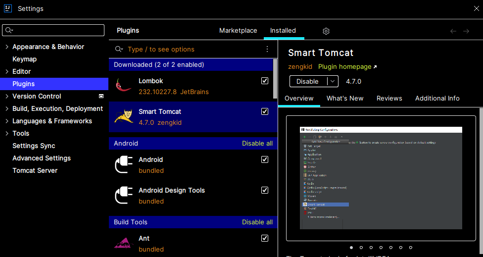

<br>

#### 2. 폴더 생성
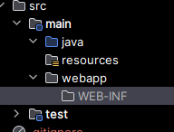

<br>

#### 3. Edit Configuration

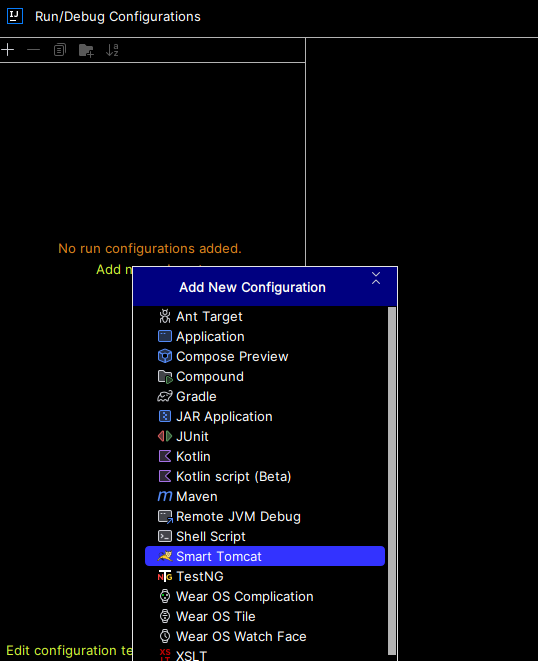

<br>

#### 4. index.jsp 파일 생성
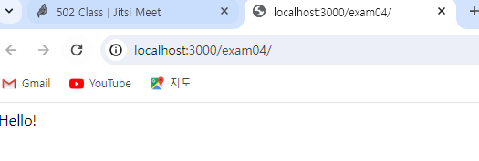

> 서버가 연결되었다!

<br>
<br>
<br>

___

- `PriterWriter` 복습
- `Arrays.toString(name)` : 배열을 편하게 출력
- `servlet`은 java의 확장된 웹 기술
- `jsp`는 번역 기술
- 서블릿은 컴파일 다시 / jsp는 컴파일 다시 할 필요 X
___

<br>

<br>

### 📝1. 스크립트 태그

#### 📂 jspex > 💾 ex01.jsp
___

#### ✅ `<% %>`스클립틀릿 내부에 입력되는 값은 `ex01.java` 파일 내의 `service`내의 `지역 변수`로 선언됨<br>
#### 👉 메서드를 선언할 수 없다 (`지역 변수`로 선언되기 때문)

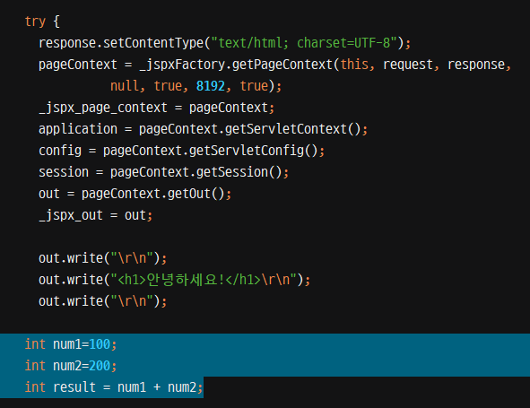

#### ✅ `<%! %>` 선언문은 `ex01.java` 파일 내의 `전역 변수`로 선언됨
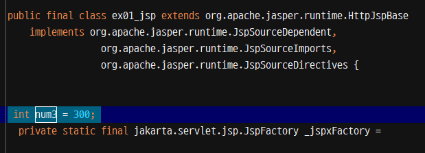

#### ✅ `<%= %>` 표현식은 `ex01.java` 파일 내의 `service`내의 `out.print();`로 표현됨
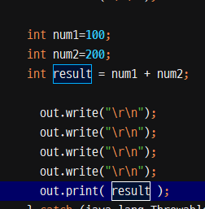

<br>
<br>

#### 📂 jspex > 💾 ex02.jsp
___

#### ✅ `<% %>`스클립틀릿 내부에 입력되는 값은 `ex02.java` 파일 내의 `service`내의 `지역 변수`로 선언됨<br>
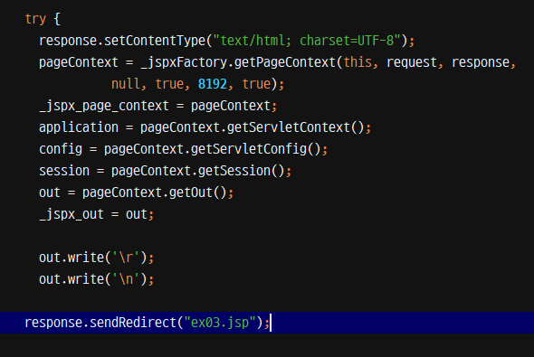

<br>
<br>

### 💾 내장 객체(`_jspService` 내부에 선언됨)
___
```
public void _jspService(final jakarta.servlet.http.HttpServletRequest request, final jakarta.servlet.http.HttpServletResponse response)
      throws java.io.IOException, jakarta.servlet.ServletException {

    if (!jakarta.servlet.DispatcherType.ERROR.equals(request.getDispatcherType())) {
      final java.lang.String _jspx_method = request.getMethod();
      if ("OPTIONS".equals(_jspx_method)) {
        response.setHeader("Allow","GET, HEAD, POST, OPTIONS");
        return;
      }
      if (!"GET".equals(_jspx_method) && !"POST".equals(_jspx_method) && !"HEAD".equals(_jspx_method)) {
        response.setHeader("Allow","GET, HEAD, POST, OPTIONS");
        response.sendError(HttpServletResponse.SC_METHOD_NOT_ALLOWED, "JSP들은 오직 GET, POST 또는 HEAD 메소드만을 허용합니다. Jasper는 OPTIONS 메소드 또한 허용합니다.");
        return;
      }
    }

    final jakarta.servlet.jsp.PageContext pageContext;
    jakarta.servlet.http.HttpSession session = null;
    final jakarta.servlet.ServletContext application;
    final jakarta.servlet.ServletConfig config;
    jakarta.servlet.jsp.JspWriter out = null;
    final java.lang.Object page = this;
    jakarta.servlet.jsp.JspWriter _jspx_out = null;
    jakarta.servlet.jsp.PageContext _jspx_page_context = null;


    try {
      response.setContentType("text/html; charset=UTF-8");
      pageContext = _jspxFactory.getPageContext(this, request, response,
      			null, true, 8192, true);
      _jspx_page_context = pageContext;
      application = pageContext.getServletContext();
      config = pageContext.getServletConfig();
      session = pageContext.getSession();
      out = pageContext.getOut();
      _jspx_out = out;

      out.write("\r\n");
      out.write("<h1>ex03.jsp 파일입니다.</h1>");
    } catch (java.lang.Throwable t) {
      if (!(t instanceof jakarta.servlet.jsp.SkipPageException)){
        out = _jspx_out;
        if (out != null && out.getBufferSize() != 0)
          try {
            if (response.isCommitted()) {
              out.flush();
            } else {
              out.clearBuffer();
            }
          } catch (java.io.IOException e) {}
        if (_jspx_page_context != null) _jspx_page_context.handlePageException(t);
        else throw new ServletException(t);
      }
    } finally {
      _jspxFactory.releasePageContext(_jspx_page_context);
    }
  }
```
- `HttpServletRequest request` 
- `HttpServletResponse response`
- ✨ `PageContext pageContext` : 페이지 정보가 담겨 있는 객체 / 다른 객체를 만들 수 있는 객체
- `HttpSession session`
- `ServletContext application`
- `ServletConfig config`
- `JspWriter out`
- `Object page = this`
- `Throwable exception` : Page 디렉티브 `isErorPage = "true"`

<br>

#### ✨ 따라서 `<%! %>`은 전역변수로 선언되므로 내장 객체를 이용할 수 없다.<br>
#### ✨ `<% %>`, `<%= %>`은 서비스내의 지역변수로 선언되므로 내장 객체를 이용할 수 있다.


<br>
<br>


### 📝 2. `init()`과 `destroy()`
#### 📂 servlets > LoginServlet
___
```
    <servlet>
        <servlet-name>login-servlet</servlet-name>
        <servlet-class>servlets.LoginServlet</servlet-class>
        <init-param>
            <param-name>key1</param-name>
            <param-value>value1</param-value>
        </init-param>
        <init-param>
            <param-name>key2</param-name>
            <param-value>value2</param-value>
        </init-param>
    </servlet>

    <servlet-mapping>
        <servlet-name>login-servlet</servlet-name>
        <url-pattern>/member/login</url-pattern>
    </servlet-mapping>
```

```
public class LoginServlet extends HttpServlet {
    @Override
    protected void doGet(HttpServletRequest req, HttpServletResponse resp) throws IOException {
        System.out.println("doGet()");
    }

    // init() -> 서블릿 객체의 초기 작업 정의
    @Override
    public void init(ServletConfig config) throws ServletException {
        System.out.println("init()");
        String key1 = config.getInitParameter("key1");
        String key2 = config.getInitParameter("key2");
        System.out.println(key1);
        System.out.println(key2);
    }

    // destroy() -> 서블릿 객체의 자원 반납
    @Override
    public void destroy() {
        System.out.println("destroy()");
    }
}
```
#### 🔵 실행결과
```
init()
value1
value2
doGet()
```

<br>
<br>

### 📝 3. `<jsp:forward page="경로" />`와 `<jsp:include file="경로" />`
#### 📂 jspex > 💾 ex05.jsp
___
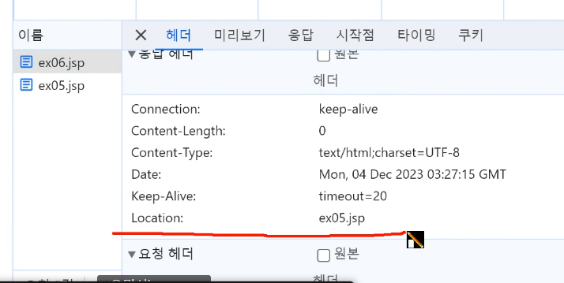
> 페이지 이동시 location 있어야함

<br>

#### ✅ `<jsp:forward page="경로" />`<br>
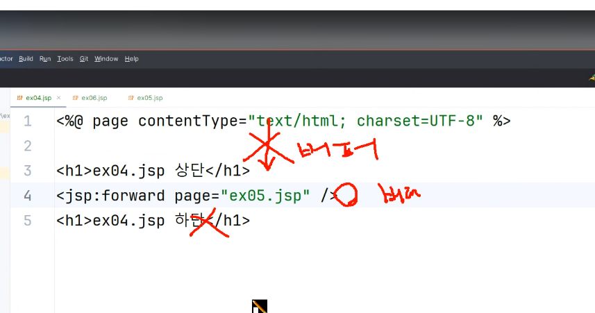
> 결과물을 버퍼에 담다가 `<jsp:forward page="경로">`를 만난 후 버퍼를 비우고
다시 담음 -> 버퍼가 교체되는 것(버퍼의 치환)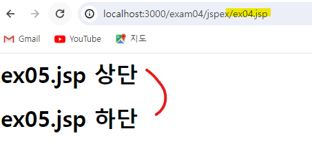

<br>


#### ✅`<jsp:include file="경로" />`
> 버퍼의 통제 기능 -> 버퍼를 담는다 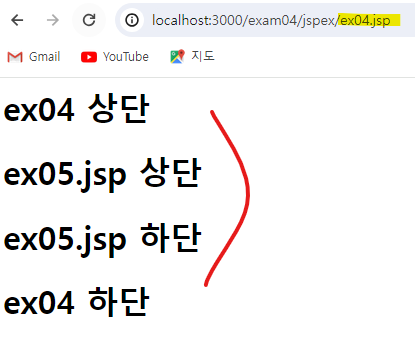


#### ✨ `View`에 `jsp`를 템플릿으로 사용함
이 때, 버퍼의 출력이 중요함

<br>
<br>

### 📝 4. MVC 모델
___

#### ✅ `Model` : 기능 (Service) - 다른 객체의 유기적 협동(기능 완성) <br>
 - DTO : 데이터 전달용 객체
 - Validator : 유효성 검사
 - DAO : 데이터 접극 객체

#### ✅ `View` : 응답 출력
    
 - JSP : 템플릿 

#### ✅ `Controller` : 요청 응답의 중재자 -> 서블릿

<br>
<br>

#### 📑 `RequestDispatcher` 인터페이스 (📂 controllers > 💾 JoinController)

- `forward` : 버퍼가 끊김
- `include` : 버퍼가 끊기지 않음

<br>

#### 📑 속성(데이터)을 관리하는 객체
- PageContext pageContext : jsp 페이지 내에서 유지
- HttpServletRequest request : 요청이 처리되는 동안 유지
- HttpSession session : 세션이 유지되는 동안 유지
- ServletContext application : 애플리케이션이 실행되는 동안 유지

✨ 데이터 유지 범위 : PageContext < HttpServletRequest < HttpSession < ServletContext <br>
✨ EL 적용 순서 : PageContext > HttpServletRequest > HttpSession > ServletContext

> - void setAttribute(String name, Object value) : 속성을 추가, 변경
> - Object getAttribute(String name) : 속성 조회
> - void removeAttribute(String name) : 속성 제거

<br>
<br>

### 📝 5. 필터와 매퍼
#### 📂 `filters` > 💾 `ex01`, `ex02`, `CommonFilter`, `CommonRequestWrapper`, `LoginServlet`
___

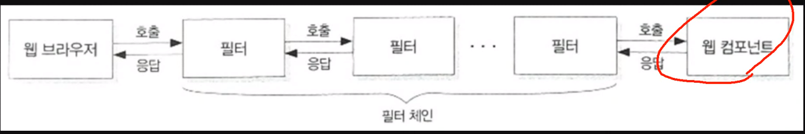
#### ✅ `LoginServlet` -> 웹 컴포넌트(필터를 통해 최종적으로 호출되는 메서드)