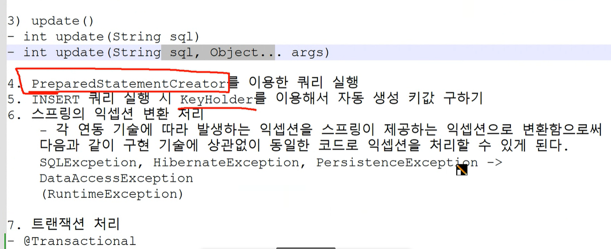

정적메소드를 동적 메모리에 올림
동적 로딩 Class.forName("패키지명을 포함한 클래스명");
클래스 파일 소스 -> 데이터 영역 메모리

자원해제를 자동으로 해주는 try ~ catch
try with Resources 구문
try(해제할 자원 객체; 해제한 자원 객체 ....){

} catch(예외 객체 ...){

}

select문 -> 쿼리문
조회 -> 쿼리스트링

집합(set, tuple)

ResultSet -> 위치를 가리킴
이동 -> 이동 하면서 값을 불러옴

spring-jdbc:JDBC API 객선 + 커넥션 풀
ex) DriverManager -> 커넥션 X
DataSource -> 커넥션 풀 O

( 톰캣-jdbc / HikariCP )
커넥션 풀
- 반응성, 성능 향상의 효과
- 오랜시간 연결이 안되어 있으면 DB와 연결 객체의 연결이 끊어짐 -> 오류

로거 연동
slf4j-api
logback-classic : 구현체

로그 레벨
FATAL
ERROR
WARN : 기능 문제X, 향후 문제 가능성이 있는 경우

정보성 로그
INFO
DEBUG
TRACE

%d -> 날짜, 시간
%5p -> 5자 내에서 로그 레벨을 출력
%c{2} -> 패키지를 요약(한글자로 요약) + 클래스명

📂 exam02 > 💾 Outer, 💾 OuterMain
내부 클래스 : 클래스 내부에 정의된 클래스
1) 인스턴스 내부 클래스
2) 정적 내부 클래스
3) 지역 내부 클래스
   1. 메서드 안의 클래스
   2. 인터페이스, 추상클래스가 객체가 되는 조건
      a. 환경 조건
        a-1. 지역 내부에 있어야 함
        a-2. 멤버 변수여야 함
      b. 미 구현된 추상 메서드의 구현 내용을 추가
4) 익명 내부 클래스

함수(메서드)내에 정의된 지역 변수
-> 호출돼서 실행할 때 변수의 자원 할당
-> 연산이 종료(return) : 자원 해제

 int c
-> 지역 변수로써 스택에서 할당받음 -> 임시메모리로써 제거되어야 함
-> 지역 내부에서 정의된 클래스의 메서드에서 사용 중일때 제거되지 않고
 -> 상수화(final) 되어 있다 -> 데이터 영역 메모리 생성(제거X)

트랜잭션 : SQL 실행 단위 (COMMIT 할때까지)
COMMIT -> DB 영구 반영

- autocommit -> true : 1개 실행 시 SQL 자동 COMMIT됨.....

setAutoCommit(boolean autoCommit) 쿼리가 여러개 있을때 자동 커밋을 false로 해둬야함

Interface Connection API에 commit()과 rollback() 메서드가 따로 있음.....

트랜잭션을 수동 관리
conn.setAutocommit(false)

핵심기능
SQL1
SQL2
SQL3
...

conn.commit(); // 공통기능
=> @Transaction (프록시가 구현되어있음)
=> 빈으로 등록해둬야함 

1) Mapper 인터페이스
2) Mapper 설정 - @MapperScan
3) Mapper 테스트
4) XML 매퍼와 함께 사용
    <mapper>
        <select>조회</select>
5) 
    </mapper>
   
=> 로그가 나오지 않음
=> 