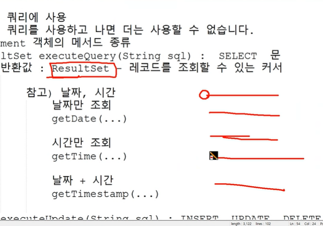

정적메소드를 동적 메모리에 올림
동적 로딩 Class.forName("패키지명을 포함한 클래스명");
클래스 파일 소스 -> 데이터 영역 메모리

자원해제를 자동으로 해주는 try ~ catch
try with Resources 구문
try(해제할 자원 객체; 해제한 자원 객체 ....){

} catch(예외 객체 ...){

}

select문 -> 쿼리문
조회 -> 쿼리스트링

집합(set, tuple)

ResultSet -> 위치를 가리킴
이동 -> 이동 하면서 값을 불러옴

spring-jdbc:JDBC API 객선 + 커넥션 풀
ex) DriverManager -> 커넥션 X
DataSource -> 커넥션 풀 O

( 톰캣-jdbc / HikariCP )
커넥션 풀
- 반응성, 성능 향상의 효과
- 오랜시간 연결이 안되어 있으면 DB와 연결 객체의 연결이 끊어짐 -> 오류
