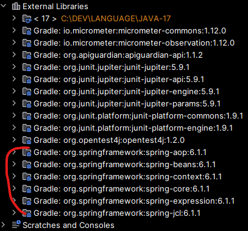

[1. 예외 처리](#1-예외-처리runtimeexception-vs-compileexception)


### spring-context
___
#### 💾 `build.gradle` 의존성 추가
`implementation 'org.springframework:spring-context:6.1.1'`

> 전부 추가 됨

<br>
<br>

### 1. 예외 처리(`RuntimeException` vs `CompileException`)
#### 📂 java > main > 💾 `Main04`, 💾 `Main05`
___
### 1-1. `CompileException` (💾 `Main04`)
 - 클래스 파일이 생성되지 않고, 컴파일 시점에 예외를 체크하고 컴파일 하지 않는다.
> 따라서 반드시 예외 처리가 필요하다.(엄격한 예외)

<br>

### 1-2. `RuntimeException`  (💾 `Main05`)
- 실행중에 예외를 체크하므로 예외가 발생하더라도 `.class` 파일이 생성된다.
- 서비스 중단을 막기 위해서 적절한 예외 처리가 필요하다.
> 유연한 예외, 예외가 발생 하더라도 실행은 됨

<br>
<br>

### 2-1. 예외 처리 구문
```
try{
    예외가 발생할 가능성이 있는 코드
} catch(예외 객체){
    예외에 대한 후속 처리
}
```

<br>
<br>

### 2. `.isblank()` vs `isEmpty()`
- `.isEmpty()` : 문자열의 길이를 체크하여, 문자열의 길이가 0인 경우에 true를 반환.(공백 포함)
- `.isblank()` : 문자열이 비어있거나, 빈 공백을 포함하고 있는 경우 true를 반환

<br>
<br>

### 3. 유효성 검사
#### 📂`common`  > 💾 `Validator`
#### 📂`common`  > 📂`validator` > 💾 `RequiredValidator`
#### 📂`models` > 📂`member` > 💾 `JoinValidator`

```java
public class JoinValidator implements Validator<Member>, RequiredValidator {

    private MemberDao memberDao;

    public JoinValidator(MemberDao memberDao){
        this.memberDao = memberDao;
    }

    public void validate(Member member){
        /*
        *  필수 항목 검증(아이디, 비밀번호, 비밀번호확인, 회원명)
        *    - 널이 아니고, 공백이 아니어야함
        * */
        String userId = member.getUserId();
        String userPw = member.getUserPw();
        String confirmPw = member.getConfirmPw();
        String userName = member.getUserName();

        // 필수 항목 - null or 빈 공백
        checkRequired(userId, new BadRequesetException("아이디를 입력하세요"));
        checkRequired(userPw, new BadRequesetException("비밀번호를 입력하세요"));
        checkRequired(confirmPw, new BadRequesetException("비밀번호를 확인하세요"));
        checkRequired(userName, new BadRequesetException("이름를 입력하세요"));

        // 비밀번호 일치 여부
        checkTrue(userPw.equals(confirmPw), new BadRequesetException("비밀번호가 일치하지 않습니다."));

        // 이미 등록된 아이디 인지
        checkFalse(memberDao.exists(userId), new BadRequesetException("이미 등록된 아이디 입니다."));
    }
}
```
<br>

> 인터페이스를 `implements`하여 `JoinValidator`라는 구현체를 구현했다.
> `JoinValidator`는 회원가입 시 유효성을 체크하는 `class`이며,
> 다른 유효성 검사가 있을 경우 `Validator<Member>`를 구현받아 만들 수 있다.

<br>

💡 `this`는 자원을 소비할 수 있는 `인스턴스`자원에만 사용할 수 있다. (`static`은 `this`가 존재하지 않음)<br>

<br>
<br>

### 5. 싱글톤 패턴
#### 💾 ServiceManager 
```java
private static ServiceManager instance = null;

public static ServiceManager getInstance(){
    if(instance==null){
        instance = new ServiceManager();
    }
    return instance;
}
```

<br>
<br>

### 6. 의존성 주입(DI) [객체조립기]
#### 📂`models`  > 📂`member`  > 💾 `ServiceManager`
```java
public class ServiceManager {

    private static ServiceManager instance = null;

    public static ServiceManager getInstance(){
        if(instance==null){
            instance = new ServiceManager();
        }
        return instance;
    }

    private ServiceManager(){
    }

    public MemberDao memberDao(){
//        return new MemberDao();
        return new CachedMemberDao(); // 다형성
    }

    public JoinValidator joinValidator(){
        return new JoinValidator(memberDao());
    }
    public JoinService joinService(){
        return new JoinService(memberDao(), joinValidator());
    }

    public MemberListService memberListService(){
        MemberListService memberListService = new MemberListService();
        memberListService.setMemberDao(memberDao());
        return memberListService;
    }
}
```
> 통제 가능성을 열기 위해서, 변경이 용이함<br>
> 파일마다 코드를 변경할 필요 없이 `ServiceManager`파일만 수정하면 된다.