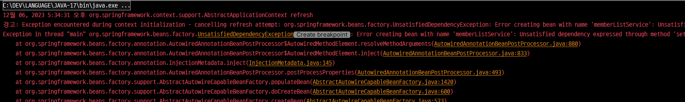
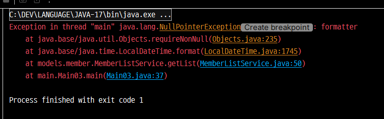

### 1. 📂config > 💾 AppCtx
___
- `@Configuration` : 설정 파일임을 알려주는 어노테이션
- `@Bean` : 스프링이 관리하는 빈 객체임을 알려주는 어노테이션

<br>

> #### 💡 스프링 컨테이너(Spring Container)
>___
>자바 객체의 생명 주기를 관리하며, 생성된 자바 객체들에게 추가적인 기능을 제공하는
객체관리 컴포넌트이다

<br>
<br>

### 2. `@Import`
#### 📂config > 💾 AppCtx3
___
- `@Import`으로 설정파일을 추가할 수 있다.

<br>
<br>

### 3. 의존 자동 주입(`@Autowired`)
___
#### 📂 models > 📂 member > 💾 MemberListService

<br>

- `@Autowired(required = false)` : 자동주입할 빈이 없어도 오류를 발생시키지 않는다.

```java
    @Autowired
    public void setDateTimeFormatter(DateTimeFormatter dateTimeFormatter) {
        this.dateTimeFormatter = dateTimeFormatter;
    }
```


> 📂 config > 💾 AppCtx3 파일에서 `dateTimeFormatter` 빈 설정 해둔 것을 취소하고
> `Main03`을 실행해보자



#### ✨ 위와 같이 `UnsatisfiedDependencyException` 에러가 발생한다<br>

<br>
<br>

> `@Autowired(required = false)`를 사용해보자

```java
    @Autowired(required = false)
    public void setDateTimeFormatter(DateTimeFormatter dateTimeFormatter) {
        this.dateTimeFormatter = dateTimeFormatter;
    }
```

#### ✨ 서비스내의 메서드에서 formatter를 찾을 수 없다는 NPE가 발생한다.

<br>

[블로그 정리](https://velog.io/@dani0817/Spring-%EA%B8%B0%EB%B3%B8-%EC%9D%98%EC%A1%B4%EA%B4%80%EA%B3%84-%EC%9E%90%EB%8F%99-%EC%A3%BC%EC%9E%85)

<br>

#### 📝2-1. 자바 표준 애너테이션
`@Inject` -> 의존성 자동 주입<br>
`@Resource` -> 의존성 자동 주입

<br>
<br>

### 4. 컴포넌트 스캔
### 1. 📂config > 💾 AppCtx4, Main04
___
```java
@Configuration
@ComponentScan("models")
public class AppCtx4 {

}
```
- `@ComponentScan("models")` : `models` 내부 클래스를 스캔하여 자동으로 스프링 빈으로 등록해줌

<br>

[블로그 정리](https://velog.io/@dani0817/Spring-%EA%B8%B0%EB%B3%B8-%EC%BB%B4%ED%8F%AC%EB%84%8C%ED%8A%B8-%EC%8A%A4%EC%BA%94%EA%B3%BC-%EC%9D%98%EC%A1%B4%EA%B4%80%EA%B3%84-%EC%9E%90%EB%8F%99-%EC%A3%BC%EC%9E%85%ED%95%98%EA%B8%B0)

