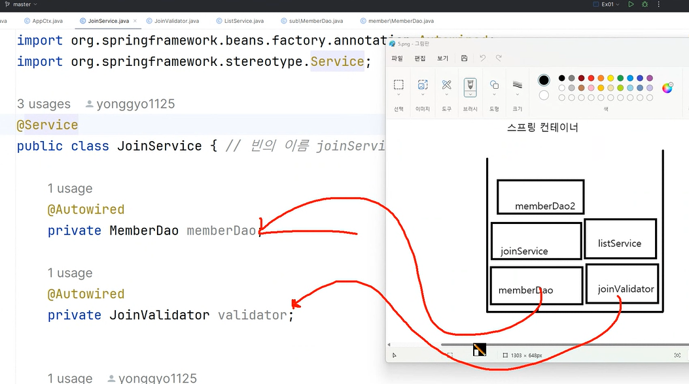

### 1. 같은 이름의 빈이 2개 일 때
#### 1-1. 자동 등록빈이 2개 일 때
-> 충돌 발생 / 이름을 지정해줘야함
#### 1-2. 하나는 자동등록빈, 하나는 수동등록 빈일때
-> 수동 등록 빈이 우선순위를 가짐

빈 객체의 초기화와 소멸 : 커스텀 메서드
1) initMethod
2) destroyMethod

애너테이션
`@PostConstruct` : 초기화 단계시 호출된 메서드
`@PreDestroy` : 소멸 전에 호출된 메서드

빈 객체의 생성과 관리 범위
`@Scope`
- 싱글톤
- 프로토타입

`@ComponentScan`의 기본 스캔 대상
@Component
@Service
@Repository
@Controller
@Configuration
@RestController
@ControllerAdvice
@RestControllerAdvice
@Aspect

객체 생성 -> 의존 설정 -> 초기화 -> 소멸

 
AOP 프로그래밍(Aspect Oriented Programming)
 - 관점 지향 프로그래밍
 - 관점? : 개발자들의 공통 관심사, 공통으로 항상 처리해야 할 부분

1. 프록시 : 대신하다, 대리하다
2. AOP
   1. @Aspect
   2. @Pointcut
      - execution 명시자
3. @Around
4. @Order
5. 프록시 생성방식
6. @Around의 Pointcut설정과 @Pointcut 재사용
