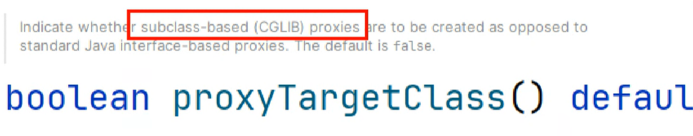
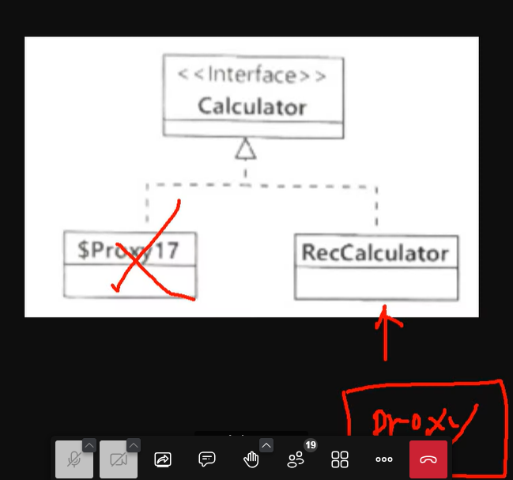
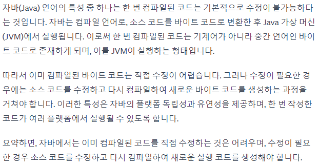

프록시 -> 대신하다, 대리하다
 - 데코레이터 패턴
 - 스프링에서 대신 해주는 관점 -> 프록시라고 관례적으로 명칭
 - 핵심기능과 공통기능이 나뉘어져 있음 -> 핵심기능:핵심 / 공통기능:부가
 - 참고: 프록시 패턴 -> 통제, 제어 관점이 추가(ex> 방화벽)

AOP

@EnableAspectJAutoProxy : 프록시 설정 활성

@Aspect -> 공통 기능이 포함된 클래스
@Pointcut -> 공통기능이 적용될 범위
 - execution 명시자

@Around : 공통 기능을 수행하고 핵심 기능을 대신 수행해주는 메서드
    ProceedingJoinPoint joinPoint
        Signature getSignature()
            getName() : 메서드명
            toLongString() : 자세한 메서드 정보
        Object proceed() : 핵심 기능 대신 수행해 주는 메서드(범용 가능)
        Object[] getArgs()
        Object getTarget() : 핵심 기능 메서드가 속해 있는 객체의 참조 변수

3. @Order(n) -> 순서가 중요한 프록시인 경우 순서 결정
    ProxyCache - > ProxyCalculator  : 정상(반대의 경우 동작 안해야함 항상 캐시가 먼저)

4. 프록시 생성 방식
@Around의 Pointcut설정과 @Pointcut 재사용

Ant 경로 패턴
aopex.* : aopex 패키지의 모든 하위 클래스
    ex) aop.Calculator

aopex..* : aopex 패키지를 포함한 하위 패키지 전체 모든 클래스
    ex)aop.sub.sub.Calculator
( ) : 메서드 매개변수 패턴
 - (..) : 0개 이상의 매개변수 패턴 
 - (*,*) : 2개의 매개변수를 가진 매개변수 패턴
 - (long) : 매개변수가 1개 있고, 자료형이 long 패턴
 - (long, *) : 매개변수가 2개, 첫번째를 long으로 고정
 - (long, ..) : 첫번째는 long으로고정, 나머지는 있어도 되고 없어도 되는 패턴

* aop.*.*() : 모든 반환값, aop의 모든 하위 클래스, 모든메서드, 매개변수 없는 메서드
* aop.*.() :

> 하이클래스 기반으로 바꿀 수 있음 / @EnableAspectJAutoProxy(proxyTargetClass = true)
> 

@Aspect : 공통 기능을 적용할 클래스

@Pointcut : 적용범휘

@Around : 핵심기능을 대신 수행해주고 공통기능을 추가해서 실행하는 메서드
 반환값은 Object (예측할 수 없음)
 매개변수 ProceedingJointPoint
                - Object proceed() : 핵심 기능을 대신 수행 메서드
                - 메서드의 정보(정의, 매개변수로 적용된 인자 값)

@EnableAspectJAutoProxy : 프록시 설정 자동화
- 인터페이스 기반 프록시
- ProxyTargetClass -> true : 하위클래스 기반 프록시