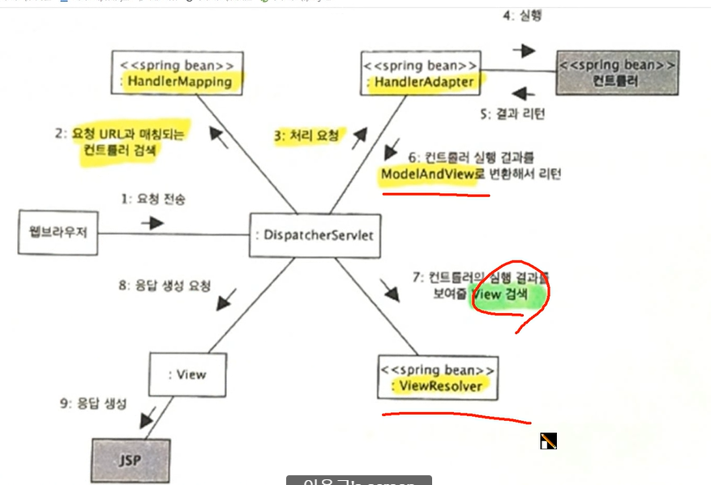
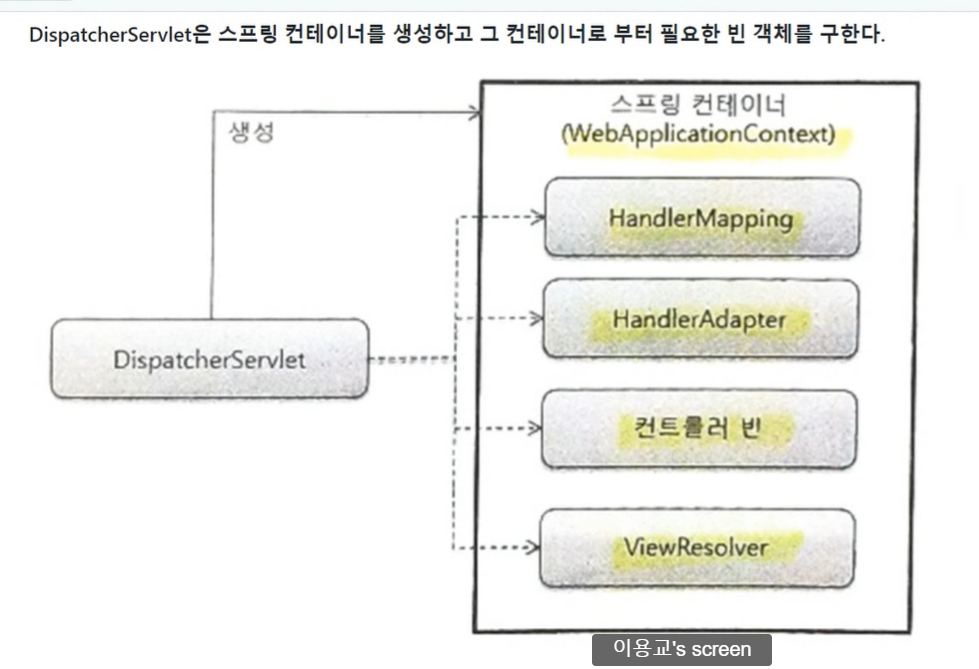
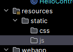
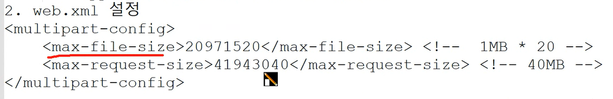
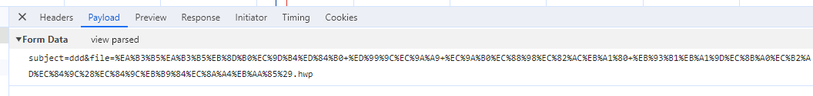
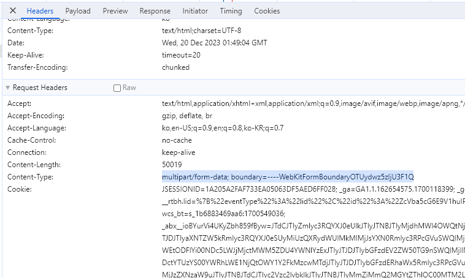
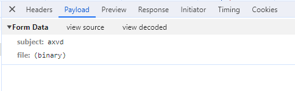

hadlerMapping 
-> url과 요청 타입으로 컨트롤러를 찾음(형식이 다양하기 때문에 바로 실행 안하고 어댑터로 넘김)

handelerAdapter
-> 스프링 빈에서 해당 컨트롤러를 찾음
-> 실행 결과를 modelandView로 변환해서 리턴

viewResolver
-> 컨트롤러의 실행결과를 보여 줄 view 호출

모든 요청 -> 서블릿(dispatcher)






모든 요청(get/hello) -> DispatcherServler -> HadlerMapping 
-> HelloController 빈 -> HandlerAdapter -> HelloController::hello호출
->ModelAndView 객체 -> ViewResolver -> View 객체 검색 -> 응답


### 4. 실행부분에 대한 설명
HandlerAdapter -> HelloController::hello에 정의된 메서드
매개변수를 파악 -> 자동 주입 -> 호출

자동 주입
1) 요청 데이터 
-> @RequestParam("파라미터명 / name") 변수
-> 요청 데이터(Get, Post)중에서 주입
-> 변수의 자료형대로 자동으로 형변환 처리

2) 서블릿 기본 객체()
편의상 서블릿 기본 객체 -> 스프링 컨테이너에 빈으로 관리되고 있다
httpServletRequest
httpServletResponse
=HttpSession ...
```java
    @GetMapping("/hello")
    public String hello(HttpServletRequest requset, HttpServletResponse response, HttpSession session) {
        System.out.println("request : " + requset);
        System.out.println("reponse : " + response);
        System.out.println("session : " + session);
        return "hello";
    }
```
3) 스프링 WebMvc 기본 객체
Model -> 데이터용 객체 -> 추가 데이터는 EL식 변수 형태로 접근 가능
   (== request.setAttribute(...))



컨트롤러와 상관없이 직접 접근이 가능하도록 설정할 것

/mypage/** : /mypage 경로를 포함한 모든 하위 경로
 /mypage, /mypage/sub1, /mypage/sub1/sub2

/mypage/* : /mypage 경로를 포함한 바로 하위 경로
/mypage, /mypage/sub1, /mypage/sub2

? : 문자 1개
/m0? -> /m01 , /m02, /m0a ...

타임리프 기본 문법
1) 변수식 : ${식...}
속성 추가 없이 
[[${식}]] - th:text="${식}"

2) 메세지 식 : #{메세지 코드}
ex)


브라우저의 언어 설정 -> 요청 헤더 -> 서버 -> Locale -> 언어 파일 분리
병렬 리소스 방식
- commons.properties
- commons_em.properties

3) 링크식 : @{링크}
컨텍스트 경로 추가
URL변수 식, 요청 파라미터 쉽게 추사
참고) <c:url value="...." />

컨텍스트 경로 : request.getContextPath()
<c:url ---> 자동으로 컨텍스트 경로가 앞에 추가
@{/member/login(키=값, 키=값)} -> /exam07/member/login?키=값&키=값
@{/member/info/{id}(id=rkqt)}
{id} - 경로 변수

4) 선택 변수 식

th : object = "${객체}"
    *{속성명}
<section> 태그 대신 사용
th:block -> 태그로써 노출 X



th:text - 텍스트만 출력
th:utext - HTML도 해석될 수 있도록 출력

th:each -> 반복문
반복 상태 EL 객체
- index : 0부터 시작하는 순번
- count : 1부터 시작하는 순번
- first : 첫번째행
- last : 마지막행
- even : 짝수행
- odd : 홀수행
<c:forEach var="item" items="${...}" varStatus={status}>
</c:forEach>


5)th:if, th:unless : 조건식
th:if="${...}"식이 참일때 출력
th:unless="${...}" 식이 거짓일 때 출력

5-2)th:switch, th:case
6)th:href -> 모든 속성 th:속성 -> 속성="번역 내용"
th:href="@{....}"
th:src="@{...}"

7)th:object


스프링 MVC폼과 에러 메세지 연동
#fields.errors(...)
#fields.globalErrors(...)




타임리프 페이지 레이아웃
th:replace
th:fragment
