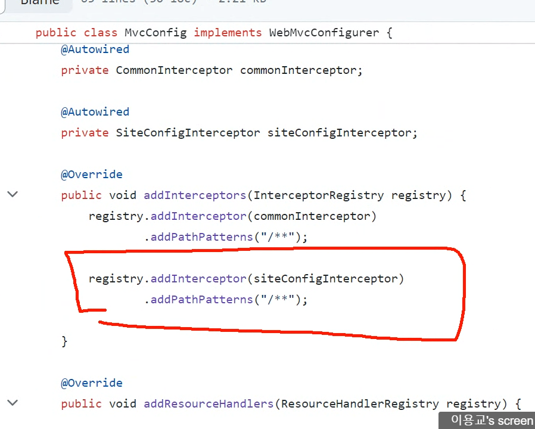
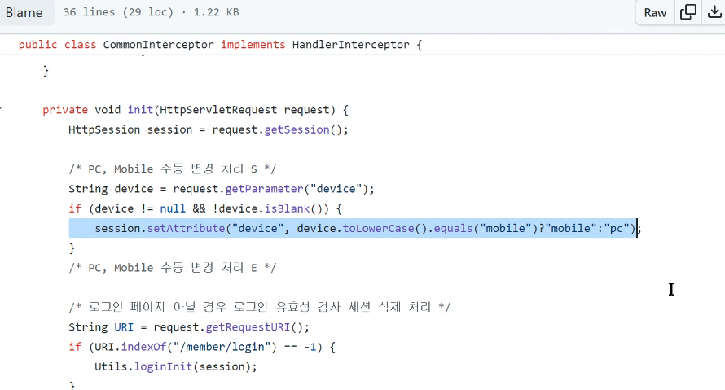

hadlerMapping 
-> url과 요청 타입으로 컨트롤러를 찾음(형식이 다양하기 때문에 바로 실행 안하고 어댑터로 넘김)

handelerAdapter
-> 스프링 빈에서 해당 컨트롤러를 찾음
-> 실행 결과를 modelandView로 변환해서 리턴

viewResolver
-> 컨트롤러의 실행결과를 보여 줄 view 호출

모든 요청 -> 서블릿(dispatcher)





모든 요청(get/hello) -> DispatcherServler -> HadlerMapping 
-> HelloController 빈 -> HandlerAdapter -> HelloController::hello호출
->ModelAndView 객체 -> ViewResolver -> View 객체 검색 -> 응답


### 4. 실행부분에 대한 설명
HandlerAdapter -> HelloController::hello에 정의된 메서드
매개변수를 파악 -> 자동 주입 -> 호출

자동 주입
1) 요청 데이터 
-> @RequestParam("파라미터명 / name") 변수
-> 요청 데이터(Get, Post)중에서 주입
-> 변수의 자료형대로 자동으로 형변환 처리

2) 서블릿 기본 객체()
편의상 서블릿 기본 객체 -> 스프링 컨테이너에 빈으로 관리되고 있다
httpServletRequest
httpServletResponse
=HttpSession ...
```java
    @GetMapping("/hello")
    public String hello(HttpServletRequest requset, HttpServletResponse response, HttpSession session) {
        System.out.println("request : " + requset);
        System.out.println("reponse : " + response);
        System.out.println("session : " + session);
        return "hello";
    }
```
3) 스프링 WebMvc 기본 객체
Model -> 데이터용 객체 -> 추가 데이터는 EL식 변수 형태로 접근 가능
   (== request.setAttribute(...))



컨트롤러와 상관없이 직접 접근이 가능하도록 설정할 것

/mypage/** : /mypage 경로를 포함한 모든 하위 경로
 /mypage, /mypage/sub1, /mypage/sub1/sub2

/mypage/* : /mypage 경로를 포함한 바로 하위 경로
/mypage, /mypage/sub1, /mypage/sub2

? : 문자 1개
/m0? -> /m01 , /m02, /m0a ...